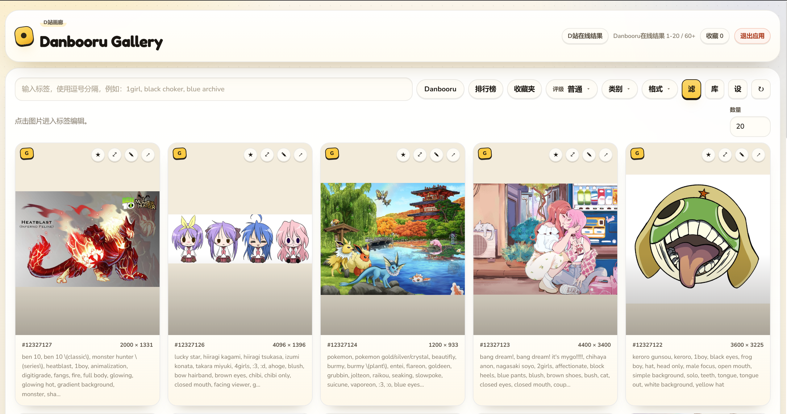
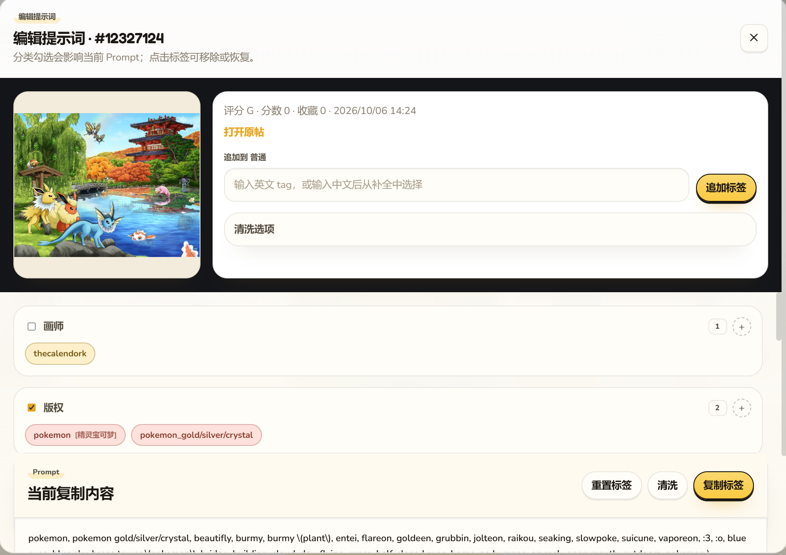

# Danbooru Gallery Standalone

Standalone web version of the Danbooru Gallery workflow, extracted from a ComfyUI plugin and rebuilt as a pure static site that runs entirely in the browser and deploys to GitHub Pages.

[简体中文](#简体中文) | [English](#english)





## English

### Overview

This repository is a standalone, fully client-side port of the Danbooru-related workflow from the original ComfyUI plugin:

- Original project: https://github.com/Aaalice233/ComfyUI-Danbooru-Gallery
- Related workflow: https://github.com/Aaalice233/ShiQi_Workflow

Earlier versions shipped a local FastAPI + SQLite backend. This version has no server at all: search, tag autocomplete, translations, prompt cleaning, favorites and the prompt library all run in the browser, so the whole app can be hosted on GitHub Pages (or opened as static files).

### Features

- Danbooru / Gelbooru image search with gallery-style browsing
- Tag autocomplete with Chinese translation support
- Prompt editing by tag category
- Prompt cleaning and formatting tools (client-side port of the original pipeline)
- Clipboard copy for final prompt output
- Prompt library stored in the browser (`localStorage`) with JSON export / import
- Optional Danbooru / Gelbooru account favorite sync
- Local favorite fallback when no account is configured
- Gelbooru score ranking with recent-range filtering
- Optional CORS / image proxy settings for hosts that block cross-origin or hotlinked requests

### Deploying to GitHub Pages

The site files live at the repository root:

```
index.html
styles.css
js/
assets/
.nojekyll
```

Publishing goes straight from the branch — there is no build step and no CI workflow:

1. Push the `github-pages` branch to GitHub.
2. In the repository, open **Settings → Pages**.
3. Set **Source** to **Deploy from a branch**, then choose branch **`github-pages`** and folder **`/ (root)`**.
4. Save; the site is served at `https://<user>.github.io/<repo>/`.

All asset paths are relative, so the site works both at a domain root and under a `/repo/` project path.

### Running locally

Serve the repository root with any static file server, for example:

```bash
python -m http.server 8000
# then open http://127.0.0.1:8000
```

Opening `index.html` directly also works in most browsers, though a local server is recommended so `localStorage` and `fetch` behave consistently.

### CORS and cross-origin notes

- The browser calls the Danbooru/Gelbooru APIs directly. Danbooru generally allows these requests; Gelbooru's API may be blocked by the browser's CORS policy.
- If a request is blocked, set a **CORS proxy** in the in-app settings (open the **设** button). A proxy that takes the target URL as `{url}` or as a URL-encoded suffix is supported, for example:
  - `https://corsproxy.io/?url={url}`
  - `https://api.allorigins.win/raw?url=`
- Images are loaded straight from the upstream CDN. If a host blocks hotlinking, set an **image proxy** in settings, for example `https://wsrv.nl/?url={url}`.
- API credentials are stored in the browser's `localStorage` only and are never sent anywhere except the upstream site you configured.

### Limitations compared to the old local build

- No server-side image upload / preview cache; the prompt library keeps text only.
- The bundled SQLite tag database was removed. Tag autocomplete now queries the upstream sites, so it needs network access.
- The prompt library and favorites live in the browser, per browser profile. Use the built-in export/import to move them between machines.
- Prompt cleaning, Chinese translation data and the default library are bundled as static assets under `assets/`.

### Project Layout

- `index.html`, `styles.css`
  Static frontend and styles.
- `js/`
  Frontend modules. `store.js` replaces the old backend (settings, library, `/api` router); `gallery-api.js` talks to Danbooru/Gelbooru; `translations.js` and `prompt-clean.js` are browser ports of the Python helpers.
- `assets/`
  Bundled Chinese tag translations and the default prompt library.
- `docs/images/`
  README screenshots.

### Notes

- This project is derived from the original MIT-licensed repository above.
- No personal account settings are committed in this public repository.
- Gelbooru API mode requires the numeric User ID and API Key from the site's API Access Credentials page.

### License

MIT. See [LICENSE](LICENSE).

## 简体中文

### 项目简介

这是一个从原始 ComfyUI 插件中拆分出来的独立 Web 版本，目标是保留 Danbooru 检索、标签编辑、提示词清洗等核心体验。

早期版本需要本地 FastAPI + SQLite 后端；这一版已经完全静态化：检索、标签补全、翻译、提示词清洗、收藏与词库全部在浏览器里完成，因此可以整体部署到 GitHub Pages（或直接用静态文件打开）。

- 原项目地址：https://github.com/Aaalice233/ComfyUI-Danbooru-Gallery
- 相关工作流：https://github.com/Aaalice233/ShiQi_Workflow

### 当前功能

- Danbooru / Gelbooru 图片检索与瀑布流浏览
- tag 自动补全与中文翻译
- 按分类编辑标签
- Prompt 清洗与格式化（原后端清洗流程的浏览器移植版）
- 一键复制最终 Prompt
- Prompt 词库保存在浏览器 `localStorage`，支持 JSON 导入 / 导出
- Danbooru / Gelbooru 账号收藏同步（可选）
- 未配置账号时的本地收藏兜底
- Gelbooru 按分数排序，并支持近期范围筛选
- 可选的 CORS / 图片代理设置，用于应对跨域或防盗链限制

### 部署到 GitHub Pages

站点文件位于仓库根目录：

```
index.html
styles.css
js/
assets/
.nojekyll
```

直接由分支发布，没有构建步骤，也没有 CI 工作流：

1. 把 `github-pages` 分支推送到 GitHub。
2. 打开仓库 **Settings → Pages**。
3. 将 **Source** 设为 **Deploy from a branch**，分支选 **`github-pages`**，目录选 **`/ (root)`**。
4. 保存后站点地址为 `https://<user>.github.io/<repo>/`。

所有资源路径均为相对路径，因此无论部署在域名根目录还是 `/repo/` 子路径都能正常访问。

### 本地运行

用任意静态服务器托管仓库根目录即可：

```bash
python -m http.server 8000
# 然后访问 http://127.0.0.1:8000
```

直接用浏览器打开 `index.html` 大多也能运行，但建议使用本地服务器，以保证 `localStorage` 与 `fetch` 行为一致。

### 跨域与代理说明

- 浏览器会直接请求 Danbooru/Gelbooru 的 API。Danbooru 通常允许跨域；Gelbooru 的 API 可能会被浏览器的 CORS 策略拦截。
- 如果请求被拦截，可在应用内设置（点击 **设** 按钮）里填写 **CORS 代理**。支持 `{url}` 占位符或“前缀 + URL 编码”两种形式，例如：
  - `https://corsproxy.io/?url={url}`
  - `https://api.allorigins.win/raw?url=`
- 图片直接来自上游 CDN。若图源限制防盗链，可在设置中填写 **图片代理**，例如 `https://wsrv.nl/?url={url}`。
- API 凭据只保存在浏览器 `localStorage`，除你配置的上游站点外不会发送到任何地方。

### 与原本地版的差异

- 不再有服务端图片上传 / 预览缓存，词库只保存文本。
- 已移除内置 SQLite 标签库；标签补全改为请求上游站点，需要联网。
- 词库与收藏保存在浏览器（按浏览器配置隔离），可用内置导入 / 导出在设备间迁移。
- 提示词清洗、中文翻译数据与默认词库都以静态资源形式随站点打包在 `assets/`。

### 目录说明

- `index.html`、`styles.css`
  静态页面与样式
- `js/`
  前端模块。`store.js` 取代原后端（设置、词库、`/api` 路由）；`gallery-api.js` 负责请求 Danbooru/Gelbooru；`translations.js`、`prompt-clean.js` 是原 Python 工具的浏览器移植版
- `assets/`
  内置的中文标签翻译与默认词库
- `docs/images/`
  README 展示截图

### 说明

- 本仓库基于原项目 MIT 许可整理而来
- 公开仓库不包含个人账号配置与私有运行数据
- Gelbooru API 模式需要站点 API Access Credentials 页面上的数字 User ID 与 API Key

### 许可证

MIT，详见 [LICENSE](LICENSE)。
